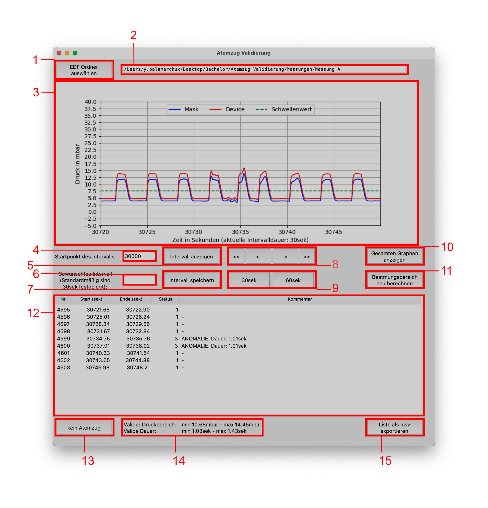
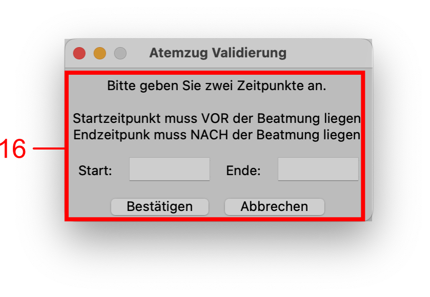

# Version 1.6 - 16.08.2024

# Installation
1. Dateien aus GitHub herunterladen und in gewünschtem Verzeichnis ablegen

2. Konsole öffnen
   - Unter Windows: 
     - Windows + R
     - In eingabefeld "cmd" eingeben und bestätigen
   - Unter Mac OS:
     - Command + Leertaste
     - In Eingabefeld "terminal" eingeben und bestätigen

3. Prüfen ob Python installiert ist
    ```bash
    python --version
    ```
    oder 
    ```bash
    python3 --version
    ```
    Wenn Python vorhanden ist, dann wird die entsprechende Version ausgegeben. 
    Sollte Python nicht erkannt werden, dann können Sie unter [python.org](https://www.python.org)
    die neueste Version von Python herunterladen und installieren.
    <u>(ACHTUNG): Bei der Installation von Python bitte das Kästchen "Add .exe to path" ankreuzen!</u>
    Nach erfolgreicher Installation bitte Konsole neu öffnen und durch Eingabe des oben aufgeführten
    Befehls prüfen ob Python erfolgreich installiert wurde.

4. Prüfen ob pip installiert ist. Dies sollte automatisch mit Python installiert werden.
    ```bash
    pip --version
    ```
    oder
    ```bash
    pip3 --version
    ```
    Wenn pip vorhanden ist, dann wird die entsprechende Version ausgegeben.

5. In Konsole zum Verzeichnis navigieren, in dem die *setup.py* Datei liegt.
Zur Navigation den Befehl "cd" benutzen.
    ```bash
    #unter Windows
    cd C:\Pfad\zum\Verzeichnis\AtemzugValidierungPYTHON-master
    
    #unter Mac
    cd /Users/Benutzername/Pfad/zum/Verzeichnis/AtemzugValidierungPYTHON-master
    ```

6. Mit dem Befehl "dir" (unter Windows) oder "ls" (unter Mac) können Sie prüfen, ob Sie sich in dem Verzeichnis mit der
*setup.py* Datei befinden. Der Befehl listet alle Dateien im Verzeichnis auf.
    ```bash
    #unter Windows
    dir
    
    #unter Mac
    ls
    ```

7. Wenn Sie sich im richtigen Verzeichnis befinden,
dann führen Sie die Installation mit dem "pip" Befehl durch. 
    ```bash
    pip install .
    ```

8. Jetzt ist das Programm einsatzbereit. 
Sie können das Programm mit folgendem Befehl in der Konsole starten:
    ```bash
    runazv
    ```

# Aktualisierung
1. Um das Programm zu aktualisieren und auf eine neue Version zu bringen
muss man nicht die komplette Installation erneut durchführen.
Dazu reicht der folgende Befehl in der Konsole:
    ```bash
    pip install --upgrade git+https://github.com/LordYev/AtemzugValidierungPYTHON
    ```

# Deinstallation
1. Um das Programm endgültig zu entfernen, müssen Sie folgenden Befehl in der
Konsole eingeben:
    ```bash
    pip uninstall AtemzugValidierung
    ```

# Benutzeranleitung
## GUI-Elemente 


1. Button zum EDF Import
2. Anzeigefeld mit Dateipfad
3. Plot
4. Eingabefeld Intervall-Start
5. Button zum Anzeigen des Intervalls
6. Eingabefeld Intervalldauer
7. Button zum Speichern der Intervalldauer
8. Buttons zum Navigieren ("<<, >>" Fast-Validation, "<, >" Navigation vorwärts & rückwärts)
9. Buttons zum Festlegen einer Standard-Intervalldauer von 30 oder 60 Sekunden
10. Button zum Anzeigen der gesamten Beatmungsdauer
11. Button zum manuellen Ermitteln des Beatmungsbereiches
12. Liste mit Atemzügen
13. Button markiert ausgewählten Atemzug als ungültig
14. Infobereich: Gibt validen Druckbereich und Dauer eines Atemzuges an
15. Button zum Exportieren im CSV-Format
16. Fenster zur Ermittlung des Beatmungsbereiches

## Bedienung
### EDF Datei importieren
1. Auf Button "EDF Ordner auswählen" (1) klicken.
2. Ordner auswählen, in dem sich beide EDF Dateien (mask.edf & device.edf) befinden.
Nur Ordner importieren, nicht die EDF Dateien einzeln.
3. Pfad wird im Anzeigefeld (2) angezeigt und Plot (3) wird erzeugt.

### Intervall anzeigen
1. Gewünschten Startpunkt ins Eingabefeld (4) eingeben
2. Bestätigen mit Button "Intervall anzeigen" (5) oder ENTER-Taste
3. Im Plot-Fenster (3) wird ein Bereich von 30 Sekunden, beginnend vom Startpunkt geplottet

### Intervalldauer festlegen 
Die Intervalldauer kann angepasst werden. Standardmäßig sind 30 Sekunden eingestellt.
1. Gewünschte Intervalldauer ins Eingabefeld (6) eingeben
2. Bestätigen mit Button "Intervall speichern" (7) oder ENTER-Taste
3. Auf Button "Intervall anzeigen" (4) klicken, damit neue Intervalldauer angezeigt wird. 
(ACHTUNG) Plot beginnt wieder an festgelegtem Startpunkt
4. Alternativ können 30 Sekunden oder 60 Sekunden mit den beiden Buttons (9) festgelegt werden.

### Navigation im Plot
Navigationsbuttons (8) werden erst freigeschaltet, sobald ein Intervall angezeigt wird.
1. Mit den Buttons "<" und ">" können Sie sich in dem Plot vorwärts und rückwärts bewegen.
2. Die Buttons "<<" und ">>" gehören zur Fast-Validation.
Hiermit springen Sie zum nächsten Atemzug mit einer Anomalie

### Gesamten Plot wieder anzeigen
1. Durch Klicken auf den Button "Gesamten Graphen anzeigen" (10) 
wird der gesamte Datensatz wieder geplottet

### Neue Erfassung des Beatmungsbereiches
Sollte der Beatmungsbereich nicht stimmen, so können Sie diesen manuell festlegen.
1. Auf Button "Beatmungsbereich neu berechnen" (11) klicken
2. Es erscheint ein neues Fenster (16). Startzeitpunkt vor und Endzeitpunkt nach
der Beatmung eingeben und auf Button "Bestätigen" klicken
3. Atemzugliste (12) wird neu befüllt

### Atemzüge kommentieren
Atemzüge, die die Bedingungen (14) nicht erfüllen, werden als ANOMALIEN (Status = 3) markiert. 
Wenn Sie einen Atemzug kommentieren möchten, dann können Sie folgendermaßen vorgehen:
1. Doppelklick in Spalte "Kommentar" in der Atemzugliste (12) 
2. Datensatz kommentieren
3. Mit ENTER-Taste bestätigen
4. Spalte "Status" ändert den Status zu "2"
5. Status des Atemzuges kann zu "1" geändert werden, 
durch Leeren des Kommentar-Feldes oder durch Eingabe von "-"

### Atemzüge als nicht valide markieren
Wenn ein Atemzug nicht relevant ist, dann kann dieser als nicht-valide markiert werden.
1. Datensatz in Atemzugliste (12) auswählen
2. Auf Button "kein Atemzug" (13) klicken
3. Status des ausgewählten Datensatzes wird zu "0" geändert
und Kommentar "kein Atemzug!" eingefügt

### Atemzugliste exportieren
Wenn die Bewertung der Atemzüge fertig ist, 
dann kann die Liste im CSV-Format exportiert werden.
1. Auf Button "Liste als .csv exportieren" (15) klicken
2. Verzeichnis zum Ablegen der CSV-Dateien auswählen und bestätigen
3. Es werden vier Dateien exportiert
   - full_data.csv (Komplette Liste)
   - invalid_data.csv (Nicht valide Daten)
   - valid_data.csv (Valide Daten)
   - commented_data.csv (Kommentierte Daten)